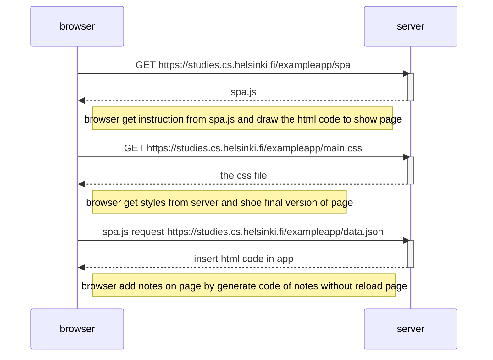

```mermaid
sequenceDiagram
    participant browser
    participant server

    browser->>server: GET https://studies.cs.helsinki.fi/exampleapp/spa
    activate server
    server-->>browser: spa.js
    deactivate server
    Note right of browser: browser get instruction from spa.js and draw the html code to show page

    browser->>server: GET https://studies.cs.helsinki.fi/exampleapp/main.css
    activate server
    server-->>browser: the css file
    deactivate server

    Note right of browser: browser get styles from server and shoe final version of page

    browser->>server:spa.js request https://studies.cs.helsinki.fi/exampleapp/data.json
    activate server
    server-->>browser: insert html code in app
    deactivate server

    Note right of browser: browser add notes on page by generate code of notes without reload page

```
