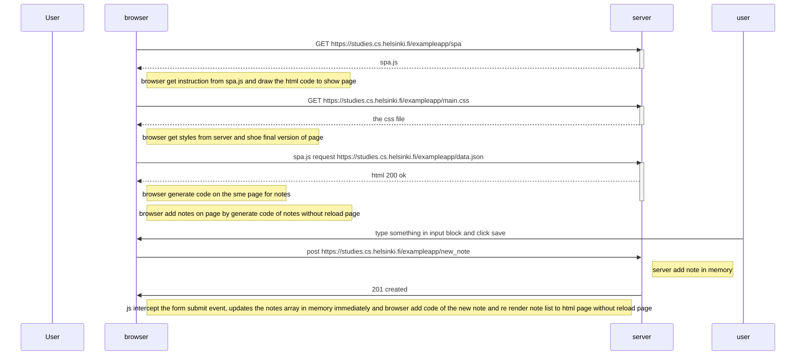

```mermaid
sequenceDiagram
    participant User
    participant browser
    participant server

    browser->>server: GET https://studies.cs.helsinki.fi/exampleapp/spa
    activate server
    server-->>browser: spa.js
    deactivate server
    Note right of browser: browser get instruction from spa.js and draw the html code to show page

    browser->>server: GET https://studies.cs.helsinki.fi/exampleapp/main.css
    activate server
    server-->>browser: the css file
    deactivate server

    Note right of browser: browser get styles from server and shoe final version of page

    browser->>server:spa.js request https://studies.cs.helsinki.fi/exampleapp/data.json
    activate server
    server-->>browser: html 200 ok
    Note right of browser: browser generate code on the sme page for notes
    deactivate server

    Note right of browser: browser add notes on page by generate code of notes without reload page

    user->>browser: type something in input block and click save
    browser->>server: post https://studies.cs.helsinki.fi/exampleapp/new_note
    Note right of server: server add note in memory
    server->>browser: 201 created

    Note right of browser: js intercept the form submit event, updates the notes array in memory immediately and browser add code of the new note and re render note list to html page without reload page

```
